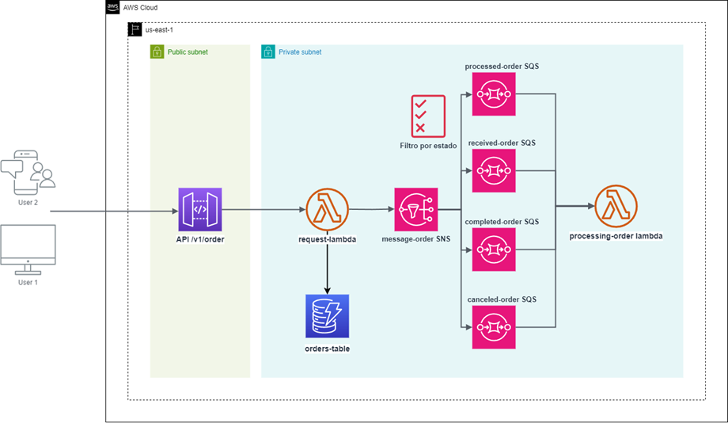

# work-order-app
Aplicación serverless para ordenes de trabajo

# run tests
pytest

# desplegar iac con serverless
serverless deploy

# curl para crear ordenes de trabajo

curl --location 'https://curpwfamjl.execute-api.us-east-1.amazonaws.com/dev/v1/order' \
--header 'Content-Type: application/json' \
--data '{
    "fecha_registro": "2025-02-15",
    "fecha_entrega": "2025-02-20",
    "descripcion": "",
    "estado": "EN_PROCESO"
}'

# Documentación adicional

Ver Documentación_solución

# Arquitectura

